## Part 1. Удаленное конфигурирование узла через Ansible

1) Создать с помощью Vagrant три машины - manager, node01, node02. Не устанавливать с помощью shell-скриптов docker при создании машин на Vagrant! Прокинуть порты node01 на локальную машину для доступа к пока еще не развернутому микросервисному приложению.

2) Подготовить manager как рабочую станцию для удаленного конфигурирования (помощь по Ansible в материалах).
- Зайти на manager. 
- На manager проверить подключение к node01 через ssh по приватной сети. 
<br/> 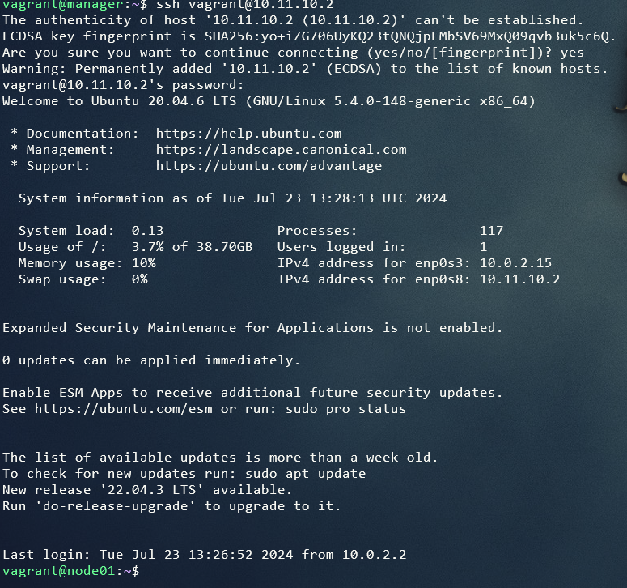
- Сгенерировать ssh-ключ для подключения к node01 из manager (без passphrase).
<br/> 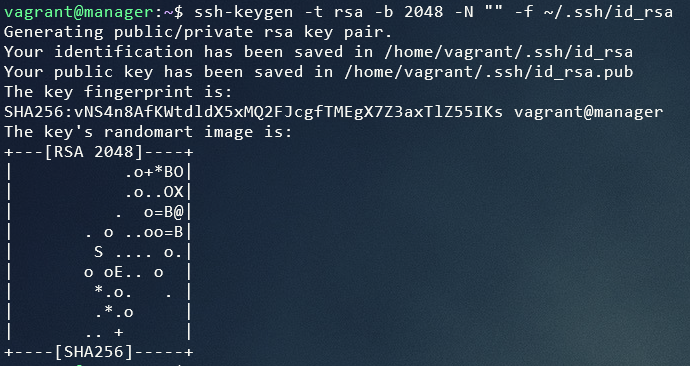

```
ssh-copy-id -i ~/.ssh/id_rsa.pub 10.11.10.2
```

- Скопировать на manager docker-compose файл и исходный код микросервисов. (Используй проект из папки src и docker-compose файл из предыдущей главы. Помощь по ssh в материалах.)
- Установить Ansible на менеджер и создать папку ansible, в которой создать inventory-файл.
<br/> 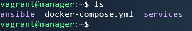
- Использовать модуль ping для проверки подключения через Ansible.
<br/> 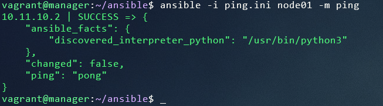


3) Написать первый плейбук для Ansible, который выполняет apt update, устанавливает docker, docker-compose, копирует compose-файл из manager'а и разворачивает микросервисное приложение.

[__Плейбук для Ansible__](ansible01/services.yml)

Запуск
<br/> 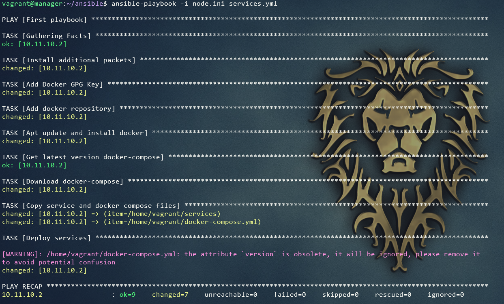

4) Прогнать заготовленные тесты через postman и удостовериться, что все они проходят успешно. В отчете отобразить результаты тестирования.
<br/> 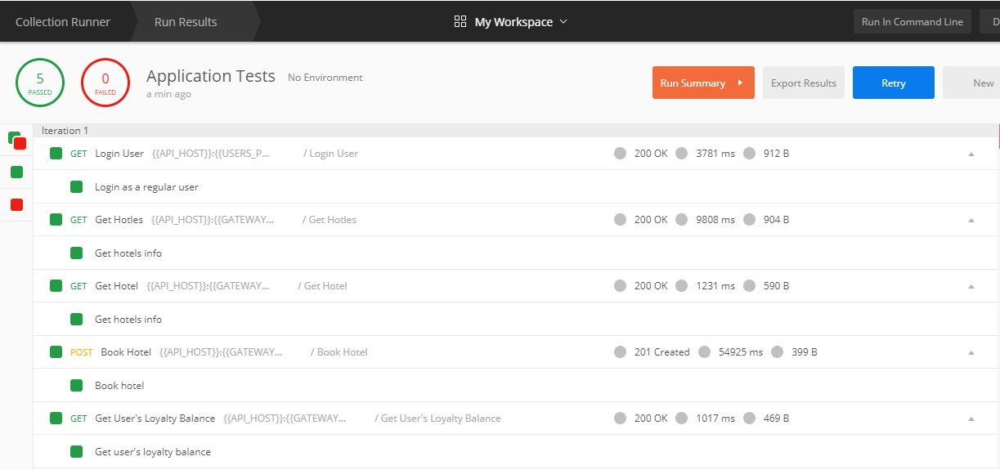

5) Сформировать три роли: 
 - [__роль application__](ansible01/roles/application/tasks/main.yml) выполняет развертывание микросервисного приложения при помощи docker-compose,
 - [__apache__](ansible01/roles/apache/tasks/main.yml) устанавливает и запускает стандартный apache сервер
 - [__postgres__](ansible01/roles/postgres/tasks/main.yml) устанавливает и запускает postgres, создает базу данных с произвольной таблицей и добавляет в нее три произвольные записи. 
 - Назначить первую роль node01 и вторые две роли node02, проверить postman-тестами работоспособность микросервисного приложения, удостовериться в доступности postgres и apache-сервера. Для Apache веб-страница должна открыться в браузере. Что касается PostgreSQL, необходимо подключиться с локальной машины и отобразить содержимое ранее созданной таблицы с данными.

 [__Назначение ролей__](ansible01/all.yml)

Запуск ansible-playbook

```ansible-playbook -i nodes.ini all.yml```

<br/> 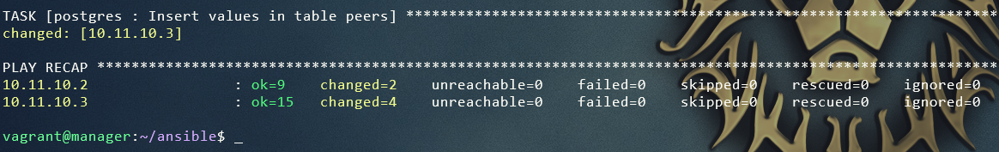

Проверка apache
<br/> 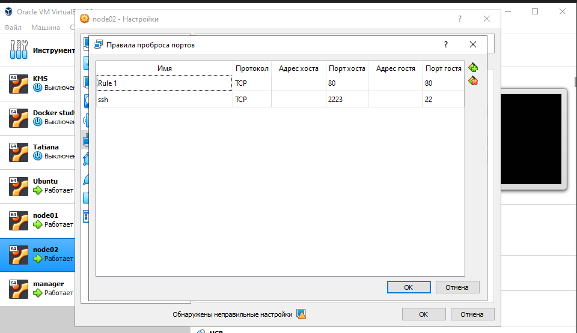
<br/> 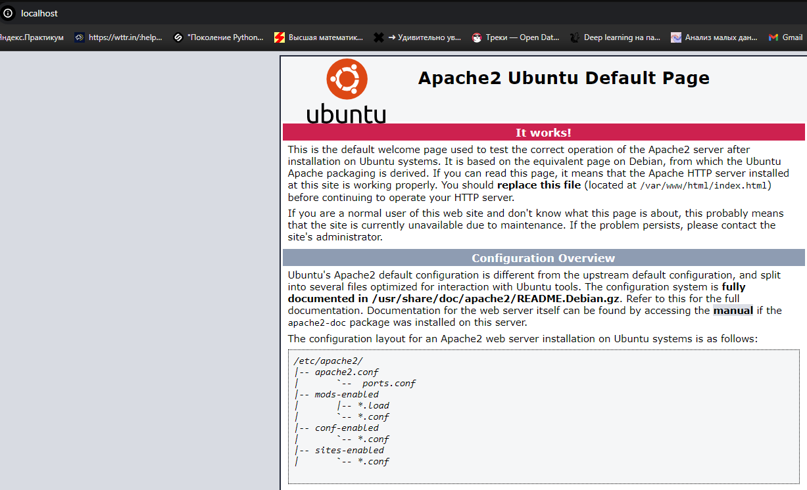

Проверка postgres
<br/> 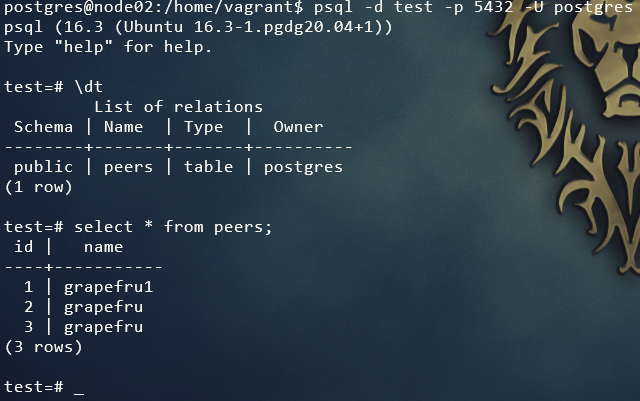

Тесты
<br/> 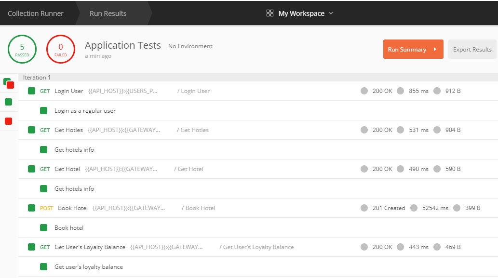

6) Созданные в этом разделе файлы разместить в папке `src\ansible01` в личном репозитории.
